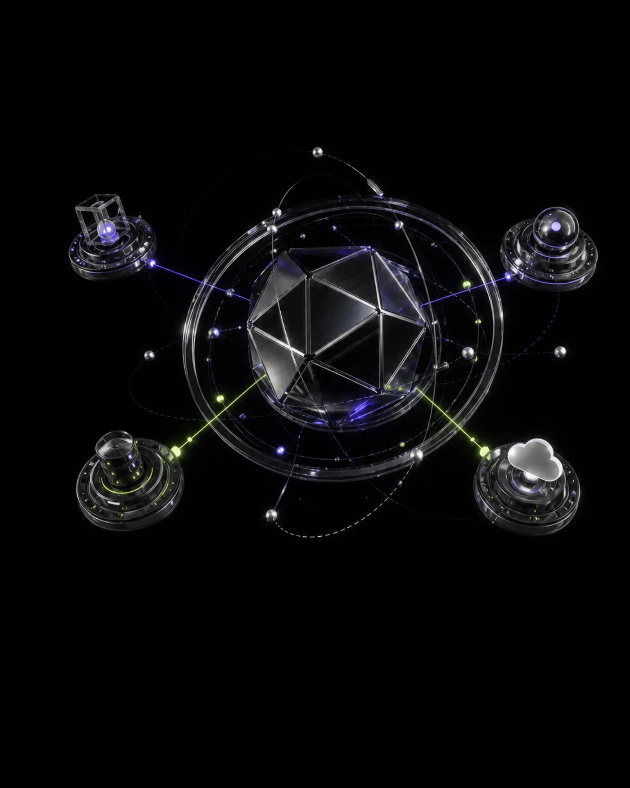

# DzCodeProgrammer — Orbital Portfolio

A high-performance personal portfolio for **Hadrian Galen Jave Dzikrillah**. The experience combines an interactive Three.js hero with image-led project worlds, technical case studies, and deliberate fallbacks for mobile, reduced-motion, and data-saving users.



## What makes this portfolio different

- A real, draggable WebGL system core built with React Three Fiber—no looping background video.
- Three distinct 3D project artworks instead of a repeated generic placeholder.
- Full case-study routes for Smart CCTV, Full-Stack Systems, and Developer Experiments.
- A responsive technical-art direction built around black chrome, violet, and signal-lime.
- Honest project labels: work remains marked as `Concept` or `Experiment` until a verified public implementation is available.
- Complete SEO metadata, JSON-LD identity data, sitemap, and robots configuration.

## Performance strategy

The visual system is intentionally progressive rather than all-or-nothing:

1. The interactive hero loads only on viewports at least 900 px wide.
2. `Save-Data` and `prefers-reduced-motion` users receive a static optimized fallback.
3. The Three.js canvas pauses when the hero leaves the viewport or the tab is hidden.
4. Device pixel ratio is capped at `1.5`; geometry is procedural and no multi-megabyte GLB is required.
5. Project artwork is pre-compressed WebP (approximately 74–89 KB per source image) and delivered through `next/image` with AVIF/WebP negotiation.
6. Off-screen sections use `content-visibility` to avoid unnecessary layout and paint work.

This produces a rich 3D impression while avoiding the cost of running several WebGL scenes or full-screen videos throughout the page.

## Accessibility and resilience

- Semantic landmarks and labelled primary navigation.
- Visible `:focus-visible` treatment for links and buttons.
- Escape-key support, scroll locking, and state attributes for the mobile menu.
- Descriptive alternative text for generated project artwork.
- Reduced-motion behavior and a native cursor fallback.
- Mobile layouts have no horizontal overflow at 390 px in automated QA.

## Tech stack

| Layer | Technology |
| --- | --- |
| Framework | Next.js 16 App Router |
| UI | React 19, TypeScript |
| 3D | Three.js, React Three Fiber, Drei |
| Icons | Lucide React |
| Styling | Hand-authored CSS, responsive design tokens |
| Rendering | Static generation for the home page and project case studies |

## Routes

| Route | Purpose |
| --- | --- |
| `/` | Main portfolio experience |
| `/projects/smart-cctv` | Computer-vision concept case study |
| `/projects/full-stack-systems` | Product-system experiment case study |
| `/projects/developer-experiments` | Creative-technology experiment case study |
| `/sitemap.xml` | Generated search sitemap |
| `/robots.txt` | Search crawler configuration |

## Project structure

```text
app/
  globals.css                 Base layout and component styles
  orbital.css                 Orbital art direction and responsive polish
  layout.tsx                  Metadata and structured identity data
  page.tsx                    Main portfolio composition
  projects/[slug]/page.tsx    Statically generated case studies
components/
  Experience.tsx              Navigation and interactive UI modules
  SystemCore.tsx              Lightweight procedural 3D scene
lib/
  projects.ts                 Typed project content and artwork mapping
public/images/
  projects/                   Optimized project artwork
design/concepts/              Image-generated visual direction references
```

## Run locally

Requirements: Node.js 20 or newer and npm.

```bash
npm install
npm run dev
```

Open `http://localhost:3000`.

Quality checks:

```bash
npm run lint
npm run build
npm audit
```

`npm run lint` performs a strict TypeScript check. `npm run build` validates the production bundle and all statically generated routes.

## Updating portfolio content

Project copy, technologies, status, case-study details, accent colors, and artwork paths live in `lib/projects.ts`. Add a new typed project entry and Next.js will generate its case-study route from the same source of truth.

Contact identity is intentionally centralized in visible page content and metadata:

- Email: [dzikrijombang@gmail.com](mailto:dzikrijombang@gmail.com)
- GitHub: [@DzCodeProgrammer](https://github.com/DzCodeProgrammer)
- LinkedIn: [Hadrian Galen Jave Dzikrillah](https://www.linkedin.com/in/dzikri-e-979742335/)

## Deployment

The project is compatible with Vercel's standard Next.js deployment flow:

1. Import this repository into Vercel.
2. Keep the framework preset set to Next.js.
3. Use `npm run build` as the build command.
4. No environment variables are required for the current version.

## Design review

The detailed before/after design, accessibility, responsiveness, and performance review is available in [AUDIT.md](AUDIT.md). The current implementation scored **45/50** in the repository's structured review, with remaining limitations documented rather than hidden.

Visual direction was informed by modern creative-studio portfolios, including Basement Studio's use of immersive worlds, oversized project presentation, and strong section rhythm. All code, compositions, project artwork, naming, and identity in this repository are original to this portfolio.

## License

Released under the [MIT License](LICENSE). Copyright © 2026 Hadrian Galen Jave Dzikrillah.
